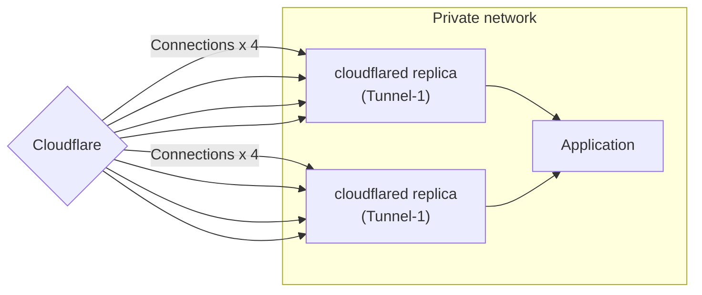
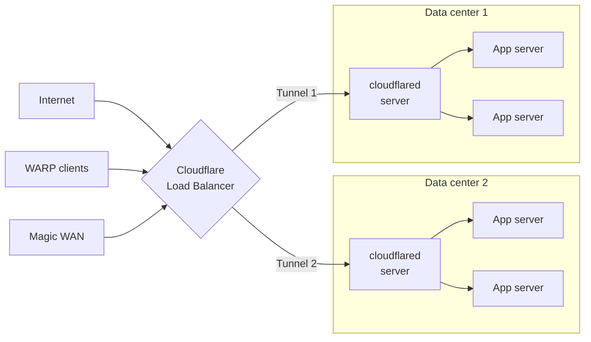
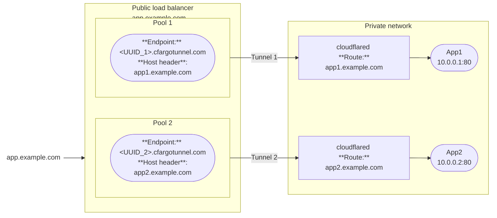
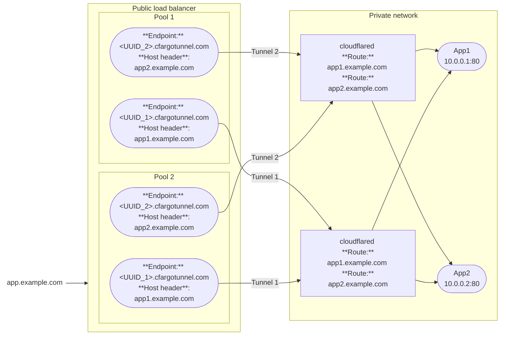
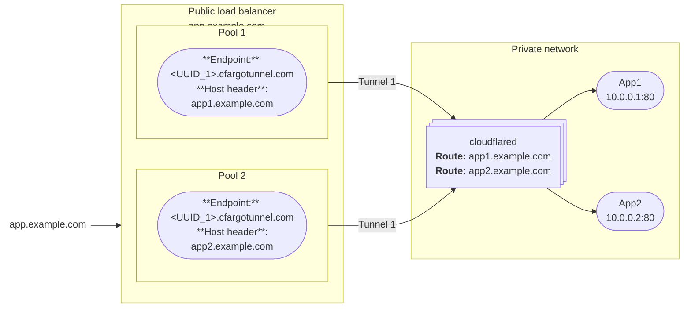
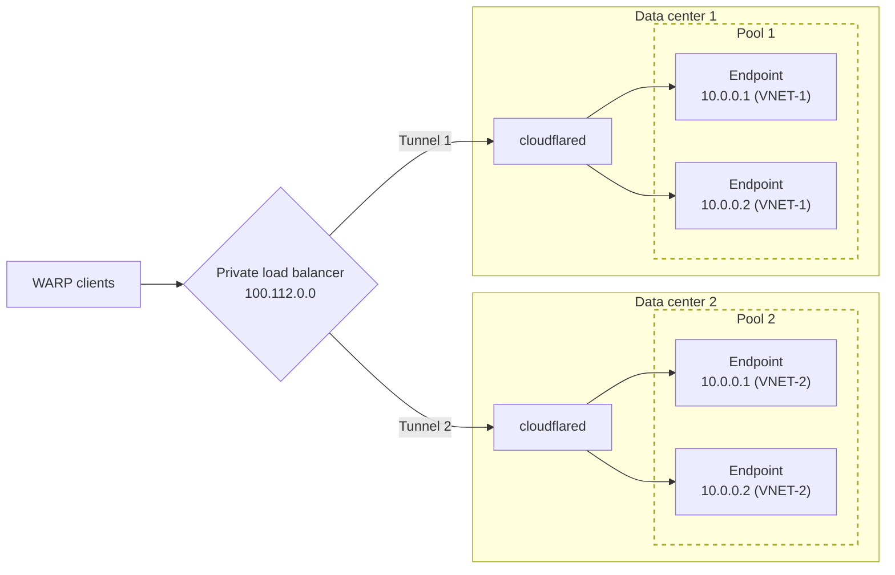

import { Details, GlossaryTooltip } from "~/components";

Our lightweight and open-source connector, [`cloudflared`](https://github.com/cloudflare/cloudflared), was built to be highly available without any additional configuration requirements. When you run a tunnel, `cloudflared` establishes four outbound-only connections between the origin server and the Cloudflare network. These four connections are made to four different servers spread across at least two distinct data centers. This model ensures high availability and mitigates the risk of individual connection failures. This means in event a single connection, server, or data center goes offline, your resources will remain available.

## `cloudflared` replicas

Cloudflare Tunnel also allows users to deploy additional instances of our connector, `cloudflared`, for availability and failover scenarios. We refer to these unique instances as replicas. Each replica establishes four new connections which serve as additional points of ingress to your origin, should you need them. Each of the replicas will point to the same tunnel. This ensures that your network remains up in the event a single host running `cloudflared` goes down.

By design, replicas do not offer any level of traffic steering (random, hash, or round-robin). Instead, when a request arrives to Cloudflare, it will be forwarded to the replica that is geographically closest. If that distance calculation is unsuccessful or the connection fails, we will retry others, but there is no guarantee about which connection is chosen.

### When to use `cloudflared` replicas

- To provide additional points of availability for a single tunnel.
- To allocate failover nodes within your network.
- To update the configuration of a tunnel [without downtime](/cloudflare-one/connections/connect-networks/downloads/update-cloudflared/#update-with-multiple-cloudflared-instances).

## Cloudflare Load Balancers

[Cloudflare Load Balancing](/load-balancing/) proactively steers traffic away from unhealthy origins and intelligently distributes the traffic load based on your choice of [steering algorithms](/load-balancing/understand-basics/traffic-steering/). Load balancers can be configured for traffic originating from both the public Internet and from within a private network.

A load balancer setup requires more than one tunnel with identical configurations. Most customers will create one tunnel per data center and one load balancer pool per tunnel.

### When to use load balancers

- To intelligently steer traffic based on latency, geolocation, or other signals.
- To implement failover logic if a tunnel reaches an inactive state.
- To get alerted when a tunnel reaches an inactive state.
- To distribute traffic more evenly across your Cloudflare Tunnel-accessible origins or endpoints.

## Public load balancer

Public load balancers steer traffic from the public Internet to your [published applications](/cloudflare-one/connections/connect-networks/routing-to-tunnel/).

e.g.
I have a web application (HTTPS) that lives in my private network and I want to securely connect it to Cloudflare's network so that my users can use their browser to access the web application from anywhere in the world

The DNS record (`UUID.cfargotunnel.com`) for each Cloudflare Tunnel can be used at the origin within the load balancer.

### Scenario 1: One tunnel per app server

Only valid for active-standby setups, since each pool has only one endpoint.

### Scenario 2: Two tunnels, each tunnel connects to both apps

good for an [Active-active](/load-balancing/load-balancers/common-configurations/#active---active-failover) setup which distributes traffic to endpoints in the same pool

### Scenario 3: One tunnel for both apps

Only valid for active-standby setups, since each pool has only one endpoint.

Note: A single origin pool in LB can't have the same Tunnel GUID referenced twice

Deploy replicas for redundancy

## Private load balancer

You can use Cloudflare Private Network Load Balancing to distribute traffic across private endpoints connected via Cloudflare Tunnel. Common use cases include:

* Load balancing internal employee traffic to internal applications
* Geosteering WARP traffic to internal applications
* Load balancing internal API calls

To set up load balancing for private IP addresses, refer to the [Private Network Load Balancing documentation](/load-balancing/private-network/tunnels-setup/).

If the server IPs overlap, then use a different virtual network in each tunnel so that Load Balancer can route requests to the correct data center and server.

