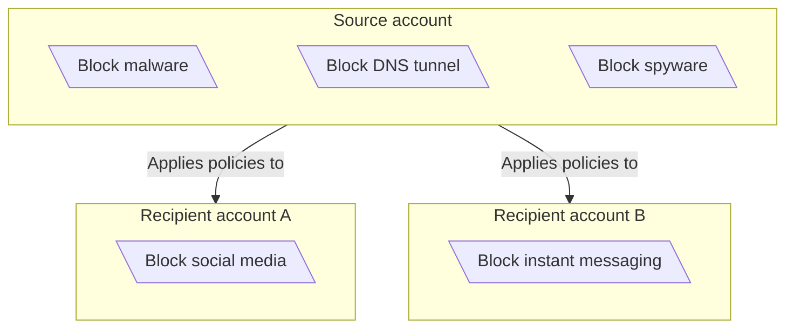
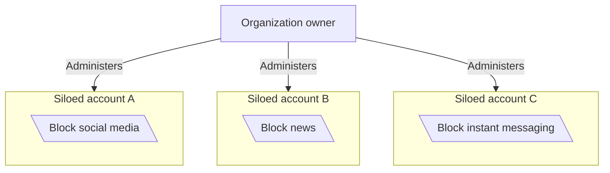

:::note
Only available on Enterprise plans. For more information, contact your account team.
:::

{/* TODO: Update the Orgs link with most up to date option */}

Gateway supports using [Cloudflare Organizations](/fundamentals/organizations/) to share configurations between and apply specific policies to accounts within an organization. Tiered organizational policies support [DNS](/cloudflare-one/policies/gateway/dns-policies/), [network](/cloudflare-one/policies/gateway/network-policies/), [HTTP](/cloudflare-one/policies/gateway/http-policies/), and [resolver](/cloudflare-one/policies/gateway/resolver-policies/) policies.

## Get started

{/* Don't need to surface much of the policy creation flow here */}

To set up Cloudflare Organizations, refer to [Create an Organization](/fundamentals/organizations/#create-an-organization). Once you have provisioned and configured your organization's accounts, you can create [Gateway policies](/cloudflare-one/policies/gateway/).

## Account types

The Gateway Tenant platform supports tiered and siloed account configurations.

### Tiered accounts

In a tiered account configuration, a top-level source account enforces global security policies that apply to all of its recipient accounts. Recipient accounts can add policies as needed while still being managed by the source account. Organization owners can also configure recipient accounts independently from the source account, including:

- Configuring a [custom block page](/cloudflare-one/policies/gateway/block-page/)
- Generating or uploading [root certificates](/cloudflare-one/connections/connect-devices/user-side-certificates/)
- Mapping [DNS locations](/cloudflare-one/connections/connect-devices/agentless/dns/locations/)
- Creating [lists](/cloudflare-one/policies/gateway/lists/)

Gateway will automatically [generate a unique root CA](/cloudflare-one/connections/connect-devices/user-side-certificates/#generate-a-cloudflare-root-certificate) for each recipient account in an organization. Each recipient account is subject to the default Zero Trust [account limits](/cloudflare-one/account-limits/).

Gateway evaluates source account policies before any recipient account policies. In a Cloudflare Organization, recipient accounts cannot bypass source account policies. All traffic and corresponding policies, logs, and configurations for a recipient account will be contained to that recipient account. Organization owners can view logs for recipient accounts on a per-account basis, and [Logpush jobs](/logs/logpush/) must be configured separately.

:::caution[Limitations]
Tiered policies do not support egress policies, device posture selectors, private apps, or virtual networks.
:::

### Siloed accounts

In a siloed account configuration, each account operates independently within the same tenant. Organization owners manage each account's own security policies, resources, and configurations separately.

