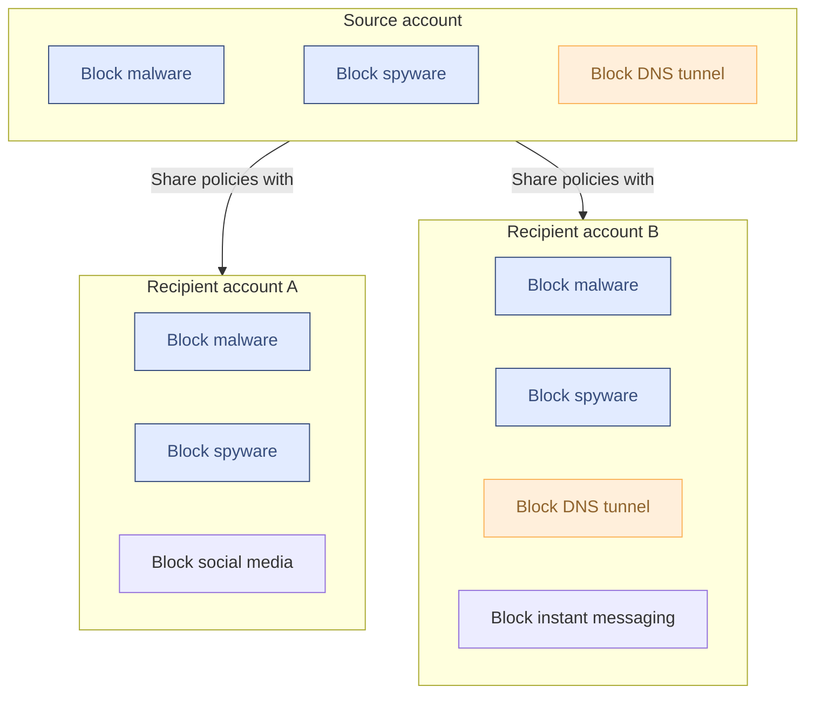

:::note
Only available on Enterprise plans. For more information, contact your account team.
:::

Gateway supports using [Cloudflare Organizations](/fundamentals/organizations/) to share configurations between and apply specific policies to accounts within an organization. Tiered Gateway policies with Organizations support [DNS](/cloudflare-one/policies/gateway/dns-policies/), [network](/cloudflare-one/policies/gateway/network-policies/), [HTTP](/cloudflare-one/policies/gateway/http-policies/), and [resolver](/cloudflare-one/policies/gateway/resolver-policies/) policies.

Managed service providers (MSPs) that are Cloudflare Partners can use tiered or siloed Gateway accounts with the Tenant API. For more information, refer to [Managed service providers (MSPs)](/cloudflare-one/policies/gateway/tiered-policies/managed-service-providers/).

## Get started

To set up Cloudflare Organizations, refer to [Create an Organization](/fundamentals/organizations/#create-an-organization). Once you have provisioned and configured your organization's accounts, you can create [Gateway policies](/cloudflare-one/policies/gateway/).

## Account types

Accounts in organizations include source accounts and recipient accounts.

In a tiered policy configuration, a top-level source account can share Gateway policies with its recipient accounts. Recipient accounts can add policies as needed while still being managed by the source account. Organization owners can also configure other settings for recipient accounts independently from the source account, including:

- Configuring a [custom block page](/cloudflare-one/policies/gateway/block-page/)
- Generating or uploading [root certificates](/cloudflare-one/connections/connect-devices/user-side-certificates/)
- Mapping [DNS locations](/cloudflare-one/connections/connect-devices/agentless/dns/locations/)
- Creating [lists](/cloudflare-one/policies/gateway/lists/)

Gateway will automatically [generate a unique root CA](/cloudflare-one/connections/connect-devices/user-side-certificates/#generate-a-cloudflare-root-certificate) for each recipient account in an organization. Each recipient account is subject to the default Zero Trust [account limits](/cloudflare-one/account-limits/).

Gateway evaluates source account policies before any recipient account policies. In a Cloudflare Organization, recipient accounts cannot bypass or modify source account policies. All traffic and corresponding policies, logs, and configurations for a recipient account will be contained to that recipient account. Organization owners can view logs for recipient accounts on a per-account basis, and [Logpush jobs](/logs/logpush/) must be configured separately.

{/* TODO: Decide best way to surface limitations. Separate section? */}

:::caution[Limitations]
Tiered policies do not support egress policies, device posture selectors, private apps, or virtual networks.
:::

## Share policy
